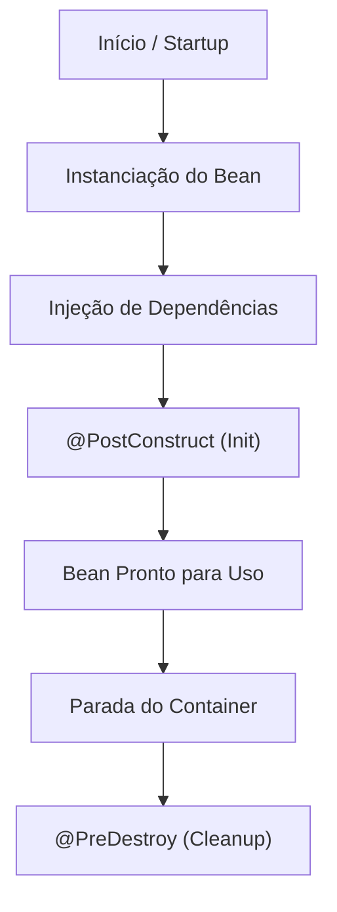

# Capítulo 02: Spring Core (Inversão de Controle e Injeção de Dependências)

Este resumo aborda os pilares centrais do Spring Framework: **Inversão de Controle (IoC)**, **Injeção de Dependências (DI)**, **Component Scanning**, escopos e ciclo de vida de Beans, além da configuração via código Java (`@Configuration` e `@Bean`).

---

## 📌 1. Conceitos Fundamentais: IoC e DI

### Inversão de Controle (Inversion of Control - IoC)
* **Definição**: É o princípio de terceirizar a criação, configuração e gerenciamento do ciclo de vida dos objetos para um container/framework (o **Spring Container** ou *ApplicationContext*), em vez de instanciá-los manualmente usando a palavra-chave `new`.
* **Benefício**: Desacoplamento do código e facilidade de configuração e substituição de componentes (ex.: trocar um `CricketCoach` por um `BaseballCoach` sem alterar quem o consome).

### Injeção de Dependências (Dependency Injection - DI)
* **Definição**: É o mecanismo prático de IoC no qual o container injeta os objetos dependentes (auxiliares) dentro do cliente que precisa deles.
* **Auto-wiring (Conexão Automática)**: O Spring busca no contexto um Bean compatível por tipo (interface ou classe) e o injeta automaticamente.

---

## 📌 2. Tipos de Injeção de Dependências

O Spring oferece diferentes formas de injetar dependências:

### 1. Injeção por Construtor (`Constructor Injection`)
* **Recomendação Oficial**: É o tipo **preferencial e recomendado** pela equipe do Spring.
* **Uso ideal**: Para dependências **obrigatórias**.
* **Vantagem**: Garante imutabilidade (`final`), impede ponteiros nulos (`NullPointerException`) e facilita testes unitários sem necessidade do contexto Spring.

> [!NOTE]
> **Sintaxe Opcional**: Se a classe possuir **apenas 1 construtor**, a anotação `@Autowired` é **opcional** a partir do Spring 4.3+.

#### Exemplo de Injeção por Construtor:
```java
package com.luv2code.springcoredemo.rest;

import com.luv2code.springcoredemo.common.Coach;
import org.springframework.beans.factory.annotation.Autowired;
import org.springframework.web.bind.annotation.GetMapping;
import org.springframework.web.bind.annotation.RestController;

@RestController
public class DemoController {

    private final Coach myCoach;

    // @Autowired é opcional se houver apenas 1 construtor
    @Autowired
    public DemoController(Coach theCoach) {
        this.myCoach = theCoach;
    }

    @GetMapping("/dailyworkout")
    public String getDailyWorkout() {
        return myCoach.getDailyWorkout();
    }
}
```

---

### 2. Injeção por Setter (`Setter Injection`)
* **Uso ideal**: Para dependências **opcionais** (onde a aplicação pode assumir um comportamento padrão razoável se o objeto não for fornecido).
* **Funcionamento**: O Spring chama o método setter ou qualquer método anotado com `@Autowired` após a instanciação do Bean.

#### Exemplo de Injeção por Setter:
```java
package com.luv2code.springcoredemo.rest;

import com.luv2code.springcoredemo.common.Coach;
import org.springframework.beans.factory.annotation.Autowired;
import org.springframework.web.bind.annotation.RestController;

@RestController
public class DemoController {

    private Coach myCoach;

    public DemoController() { }

    @Autowired
    public void setCoach(Coach theCoach) {
        this.myCoach = theCoach;
    }
    
    // NOTA: Qualquer nome de método funciona com @Autowired
    // @Autowired
    // public void doSomeStuff(Coach theCoach) {
    //     this.myCoach = theCoach;
    // }
}
```

---

### 3. Injeção de Campo (`Field Injection`) — 🛑 Não Recomendada
Consiste em anotar diretamente os atributos da classe com `@Autowired` usando reflexão.
* **Status**: **Descontinuada / Não recomendada** pela Spring.io.
* **Motivo**: Dificulta a criação de testes unitários (exige Java Reflection ou mocks complexos) e esconde dependências circulares.

```java
// 🛑 EVITAR em projetos novos
@Autowired
private Coach myCoach; 
```

---

## 📌 3. Escaneamento de Componentes (`Component Scanning`)

Por padrão, a anotação `@SpringBootApplication` ativa o `@ComponentScan` para o **pacote raiz** onde a classe principal está localizada e todos os seus **subpacotes de forma recursiva**.

### Estrutura Recomendada (Padrão):
```text
com.luv2code.springcoredemo/               <-- Classe Principal com @SpringBootApplication
├── SpringCoreDemoApplication.java
├── common/                                 <-- Subpacote escaneado automaticamente
│   ├── Coach.java
│   └── CricketCoach.java
└── rest/                                   <-- Subpacote escaneado automaticamente
    └── DemoController.java
```

### Escaneando Pacotes Fora da Raiz Padrão
Se existirem componentes em pacotes fora da hierarquia principal (ex: `com.luv2code.util`), é necessário declarar explicitamente os pacotes em `scanBasePackages`:

```java
package com.luv2code.springcoredemo;

import org.springframework.boot.SpringApplication;
import org.springframework.boot.autoconfigure.SpringBootApplication;

@SpringBootApplication(scanBasePackages = {
    "com.luv2code.springcoredemo",
    "com.luv2code.util",
    "org.acme.cart"
})
public class SpringCoreDemoApplication {
    public static void main(String[] args) {
        SpringApplication.run(SpringCoreDemoApplication.class, args);
    }
}
```

---

## 📌 4. Resolução de Ambiguidade: `@Qualifier` e `@Primary`

Quando uma interface possui **múltiplas implementações** registradas como Beans (ex: `CricketCoach`, `BaseballCoach`, `TrackCoach`, `TennisCoach`), o Spring não consegue decidir qual injetar e lança a exceção `NoUniqueBeanDefinitionException`.

### Solução 1: `@Qualifier` (Recomendada / Maior Prioridade)
Especifica exatamente o **Bean ID** que deve ser injetado.
* **Regra do Bean ID Padrão**: Nome da classe em sintaxe *camelCase* (primeira letra minúscula).
  * Exemplo: Classe `CricketCoach` $\rightarrow$ Bean ID `cricketCoach`.

#### Exemplo com Constructor Injection:
```java
@Autowired
public DemoController(@Qualifier("cricketCoach") Coach theCoach) {
    this.myCoach = theCoach;
}
```

#### Exemplo com Setter Injection:
```java
@Autowired
public void setCoach(@Qualifier("trackCoach") Coach theCoach) {
    this.myCoach = theCoach;
}
```

---

### Solução 2: `@Primary`
Define uma implementação padrão quando nenhuma qualificadora for especificada.

```java
package com.luv2code.springcoredemo.common;

import org.springframework.context.annotation.Primary;
import org.springframework.stereotype.Component;

@Component
@Primary
public class TrackCoach implements Coach {
    @Override
    public String getDailyWorkout() {
        return "Run a hard 5k!";
    }
}
```

> [!WARNING]
> **Regras e Conflitos entre `@Primary` e `@Qualifier`**:
> 1. Só pode haver **uma única classe** marcada com `@Primary` para a mesma interface. Múltiplas classes com `@Primary` causarão erro na inicialização.
> 2. **`@Qualifier` tem prioridade absoluta sobre `@Primary`**. Se ambas existirem, o Spring utilizará o `@Qualifier`.

---

## 📌 5. Inicialização Tardia (`Lazy Initialization`)

Por padrão, ao iniciar a aplicação, **todos os Beans singleton são criados e inicializados imediatamente**.

### Anotação `@Lazy`
Faz com que o Bean seja instanciado apenas quando for solicitado ou exigido como dependência por outro componente.

```java
package com.luv2code.springcoredemo.common;

import org.springframework.context.annotation.Lazy;
import org.springframework.stereotype.Component;

@Component
@Lazy
public class TrackCoach implements Coach {
    public TrackCoach() {
        System.out.println("In constructor: " + getClass().getSimpleName());
    }
}
```

### Configuração Global de Lazy Initialization
Para tornar **todos** os Beans da aplicação preguiçosos (*lazy*), configure no `application.properties`:

```properties
spring.main.lazy-initialization=true
```

| Prós | Contras |
| :--- | :--- |
| Inicialização mais rápida do sistema | Erros de configuração só aparecem em tempo de execução quando o Bean é acessado |
| Economia de memória na inicialização | Primeira requisição ao Bean pode ser ligeiramente mais lenta |

---

## 📌 6. Escopos de Beans (`Bean Scopes`)

O escopo define a vida útil, visibilidade e quantidade de instâncias criadas pelo container.

### Tipos de Escopos

| Escopo | Descrição |
| :--- | :--- |
| **`singleton`** (Padrão) | Cria uma **única instância** por container Spring. Compartilhada em todas as injeções. |
| **`prototype`** | Cria uma **nova instância** a cada ponto de injeção ou solicitação ao container. |
| `request` | Uma instância por requisição HTTP (Somente Web). |
| `session` | Uma instância por sessão HTTP de usuário (Somente Web). |
| `application` | Uma instância por `ServletContext` (Somente Web). |
| `websocket` | Uma instância por ciclo de vida de WebSocket. |

### Sintaxe de Configuração de Escopo:

```java
package com.luv2code.springcoredemo.common;

import org.springframework.beans.factory.config.ConfigurableBeanFactory;
import org.springframework.context.annotation.Scope;
import org.springframework.stereotype.Component;

@Component
@Scope(ConfigurableBeanFactory.SCOPE_PROTOTYPE) // ou SCOPE_SINGLETON
public class CricketCoach implements Coach {
    // ...
}
```

---

## 📌 7. Ciclo de Vida do Bean (`Bean Lifecycle`)

### Etapas do Ciclo de Vida
1. Instanciação do objeto pelo Spring (`new`).
2. Injeção de Dependências (Properties/Autowired).
3. Processamento Interno do Spring.
4. **Inicialização Personalizada**: Método anotado com `@PostConstruct`.
5. **Bean Pronto para Uso**.
6. Encerramento do Container.
7. **Destruição Personalizada**: Método anotado com `@PreDestroy`.



### Anotações `@PostConstruct` e `@PreDestroy`

```java
package com.luv2code.springcoredemo.common;

import jakarta.annotation.PostConstruct;
import jakarta.annotation.PreDestroy;
import org.springframework.stereotype.Component;

@Component
public class CricketCoach implements Coach {

    // Método de inicialização (executado após a injeção de dependências)
    @PostConstruct
    public void doMyStartupStuff() {
        System.out.println("In doMyStartupStuff(): " + getClass().getSimpleName());
    }

    // Método de destruição (executado antes de encerrar o Bean)
    @PreDestroy
    public void doMyCleanupStuff() {
        System.out.println("In doMyCleanupStuff(): " + getClass().getSimpleName());
    }

    @Override
    public String getDailyWorkout() {
        return "Practice fast bowling for 15 minutes";
    }
}
```

> [!CAUTION]
> **Atenção Especial ao Escopo `prototype`**:
> Para Beans com escopo **`prototype`**, o Spring chama o método `@PostConstruct`, mas **NÃO chama o método `@PreDestroy`**! O gerenciamento da destruição e liberação de recursos de objetos *prototype* é de responsabilidade exclusiva do código cliente.

---

## 📌 8. Configuração de Beans em Código Java (`@Configuration` e `@Bean`)

Embora o `@Component` cubra a maioria dos casos, a anotação `@Bean` em classes de configuração é a abordagem utilizada para **tornar classes de terceiros (de bibliotecas externas/JARs) em Beans do Spring**.

### Caso de Uso Principal
Classes de terceiros (ex: SDK da AWS `S3Client`, conectores de banco de dados, bibliotecas legadas) não possuem o código fonte editável para adicionarmos a anotação `@Component`. Através de uma classe `@Configuration`, instanciamos o objeto manualmente e o expomos via `@Bean`.

### Passo a Passo de Implementação:

#### Passo 1: Criar a classe que representa o recurso (ex: `SwimCoach` sem `@Component`)
```java
package com.luv2code.springcoredemo.common;

// NOTA: Sem a anotação @Component!
public class SwimCoach implements Coach {

    public SwimCoach() {
        System.out.println("In constructor: " + getClass().getSimpleName());
    }

    @Override
    public String getDailyWorkout() {
        return "Swim 1000 meters as a warmup";
    }
}
```

#### Passo 2: Criar a classe `@Configuration` e declarar o `@Bean`
```java
package com.luv2code.springcoredemo.config;

import com.luv2code.springcoredemo.common.Coach;
import com.luv2code.springcoredemo.common.SwimCoach;
import org.springframework.context.annotation.Bean;
import org.springframework.context.annotation.Configuration;

@Configuration
public class SportConfig {

    // O ID do Bean por padrão será o nome do método ("swimCoach")
    @Bean
    public Coach swimCoach() {
        return new SwimCoach();
    }

    // ID de Bean Customizado (Opcional):
    // @Bean("aquatic")
    // public Coach swimCoach() {
    //     return new SwimCoach();
    // }
}
```

#### Passo 3: Injetar o Bean no Controller usando o Qualifier correspondente
```java
@RestController
public class DemoController {

    private final Coach myCoach;

    @Autowired
    public DemoController(@Qualifier("swimCoach") Coach theCoach) { // ou @Qualifier("aquatic")
        this.myCoach = theCoach;
    }

    @GetMapping("/dailyworkout")
    public String getDailyWorkout() {
        return myCoach.getDailyWorkout();
    }
}
```

---

## 📋 Tabela Resumo das Anotações do Capítulo 02

| Anotação | Pacote / Import | Propósito / Descrição |
| :--- | :--- | :--- |
| **`@Component`** | `org.springframework.stereotype` | Marca a classe como um Spring Bean para escaneamento e injeção automática. |
| **`@Autowired`** | `org.springframework.beans.factory.annotation` | Solicita ao Spring que injete a dependência correspondente. |
| **`@Qualifier`** | `org.springframework.beans.factory.annotation` | Desambigua a injeção especificando o Bean ID exato a ser utilizado. |
| **`@Primary`** | `org.springframework.context.annotation` | Marca um Bean como escolha prioritária quando houver múltiplas opções. |
| **`@Lazy`** | `org.springframework.context.annotation` | Atrasa a criação do Bean até o momento em que ele for realmente solicitado. |
| **`@Scope`** | `org.springframework.context.annotation` | Configura o escopo (`singleton`, `prototype`, etc.). |
| **`@PostConstruct`** | `jakarta.annotation` | Executa o método de inicialização após a injeção de dependências. |
| **`@PreDestroy`** | `jakarta.annotation` | Executa o método de limpeza antes que o Bean seja destruído pelo container. |
| **`@Configuration`** | `org.springframework.context.annotation` | Marca a classe como uma fonte de definições de Beans. |
| **`@Bean`** | `org.springframework.context.annotation` | Declara que um método dentro de uma classe `@Configuration` retorna um Bean gerenciado. |
