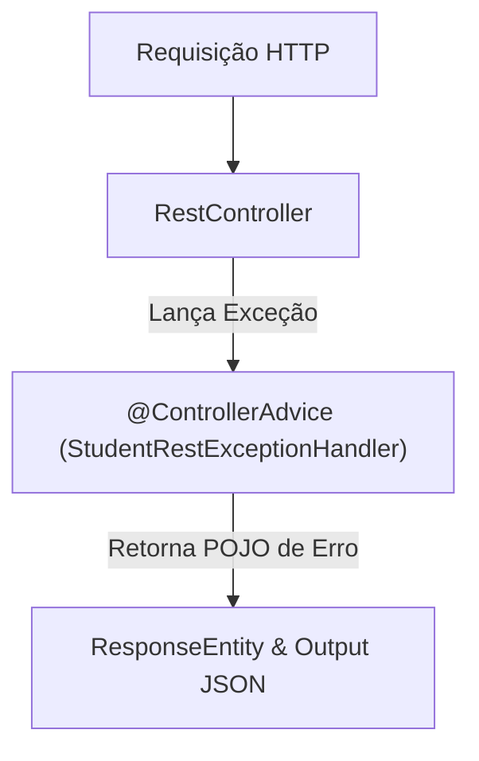

# Capítulo 04: REST CRUD APIs

Este resumo abrange a construção de APIs Web RESTful com **Spring Boot 4**, tratamento de exceções globais com `@ControllerAdvice`, serialização e desserialização de JSON usando **Jackson**, boas práticas de arquitetura REST, atualização parcial via **HTTP PATCH**, além das automações com **Spring Data JPA** e **Spring Data REST**.

---

## 📌 1. Fundamentos de Arquitetura e Protocolo REST HTTP

### O que é REST (Representational State Transfer)?
Estilo arquitetural leve e independente de linguagem de programação para comunicação entre aplicações através do protocolo HTTP.

### Verbos HTTP Mapeados para Operações CRUD

| Verbo HTTP | Operação CRUD | Descrição / Exemplo de Endpoint |
| :--- | :--- | :--- |
| **`GET`** | **Read** | Recupera um recurso ou uma lista de recursos (`/api/employees`, `/api/employees/1`). |
| **`POST`** | **Create** | Cria um novo recurso (`/api/employees`). O payload vai no corpo em JSON. |
| **`PUT`** | **Update** | Substitui/Atualiza o recurso **completo** (`/api/employees`). |
| **`PATCH`** | **Partial Update** | Atualiza apenas **campos específicos** de um recurso (`/api/employees/1`). |
| **`DELETE`** | **Delete** | Remove um recurso existente por ID (`/api/employees/1`). |

---

## 📌 2. Fundamentos de JSON e Jackson Data Binding

### O que é JSON (JavaScript Object Notation)?
Formato leve em texto puro para troca de dados baseado em pares `nome: valor`.

### Data Binding com Jackson
O Spring Boot utiliza a biblioteca **Jackson** por trás dos panos para realizar a conversão automática entre JSON e objetos Java (**POJOs**):
* **JSON $\rightarrow$ Java POJO**: Chama os **métodos Setter** da classe Java.
* **Java POJO $\rightarrow$ JSON**: Chama os **métodos Getter** da classe Java.

---

## 📌 3. Construção de Controladores REST em Spring

### Anotações Principais:
* **`@RestController`**: Combinação de `@Controller` + `@ResponseBody`. Indica que a resposta dos métodos é serializada e enviada diretamente no corpo da resposta HTTP (geralmente JSON).
* **`@RequestMapping("/caminho")`**: Define o prefixo base de URL para o controller.
* **`@GetMapping` / `@PostMapping` / `@PutMapping` / `@PatchMapping` / `@DeleteMapping`**: Mapeiam métodos para verbos HTTP específicos.
* **`@PathVariable`**: Captura variáveis passadas diretamente no caminho da URL (ex: `/api/students/{studentId}`).
* **`@RequestBody`**: Desserializa o corpo da requisição HTTP (payload JSON) para o parâmetro do objeto Java.

### Controller com `@PathVariable` e `@PostConstruct`

```java
package com.luv2code.demo.rest;

import com.luv2code.demo.entity.Student;
import jakarta.annotation.PostConstruct;
import org.springframework.web.bind.annotation.*;

import java.util.ArrayList;
import java.util.List;

@RestController
@RequestMapping("/api")
public class StudentRestController {

    private List<Student> theStudents;

    // Preenche a lista apenas UMA vez após a construção do Bean
    @PostConstruct
    public void loadData() {
        theStudents = new ArrayList<>();
        theStudents.add(new Student("Poornima", "Patel"));
        theStudents.add(new Student("Mario", "Rossi"));
        theStudents.add(new Student("Mary", "Smith"));
    }

    // Endpoint GET para buscar todos
    @GetMapping("/students")
    public List<Student> getStudents() {
        return theStudents;
    }

    // Endpoint GET com Path Variable (ex: /api/students/0)
    @GetMapping("/students/{studentId}")
    public Student getStudent(@PathVariable int studentId) {
        return theStudents.get(studentId);
    }
}
```

---

## 📌 4. Tratamento Global de Exceções (`@ControllerAdvice`)

Para evitar a exibição de páginas de erro HTML genéricas (Erro 500/404) ou vazamento de *stack traces*, o Spring oferece um padrão centralizado de tratamento de erros usando **`@ControllerAdvice`** e **`@ExceptionHandler`**.



### Passo 1: Criar o POJO do Modelo de Erro (`StudentErrorResponse.java`)
```java
package com.luv2code.demo.rest;

public class StudentErrorResponse {
    private int status;
    private String message;
    private long timeStamp;

    public StudentErrorResponse() {}

    public StudentErrorResponse(int status, String message, long timeStamp) {
        this.status = status;
        this.message = message;
        this.timeStamp = timeStamp;
    }

    // Getters e Setters
    public int getStatus() { return status; }
    public void setStatus(int status) { this.status = status; }

    public String getMessage() { return message; }
    public void setMessage(String message) { this.message = message; }

    public long getTimeStamp() { return timeStamp; }
    public void setTimeStamp(long timeStamp) { this.timeStamp = timeStamp; }
}
```

### Passo 2: Criar a Exceção Customizada (`StudentNotFoundException.java`)
```java
package com.luv2code.demo.rest;

public class StudentNotFoundException extends RuntimeException {
    public StudentNotFoundException(String message) {
        super(message);
    }
}
```

### Passo 3: Implementar o Tratador Global (`StudentRestExceptionHandler.java`)
```java
package com.luv2code.demo.rest;

import org.springframework.http.HttpStatus;
import org.springframework.http.ResponseEntity;
import org.springframework.web.bind.annotation.ControllerAdvice;
import org.springframework.web.bind.annotation.ExceptionHandler;

@ControllerAdvice
public class StudentRestExceptionHandler {

    // Trata exceção de estudante não encontrado (404 Not Found)
    @ExceptionHandler
    public ResponseEntity<StudentErrorResponse> handleException(StudentNotFoundException exc) {
        StudentErrorResponse error = new StudentErrorResponse(
                HttpStatus.NOT_FOUND.value(),
                exc.getMessage(),
                System.currentTimeMillis()
        );
        return new ResponseEntity<>(error, HttpStatus.NOT_FOUND);
    }

    // Trata exceções genéricas / dados inválidos na URL (400 Bad Request)
    @ExceptionHandler
    public ResponseEntity<StudentErrorResponse> handleException(Exception exc) {
        StudentErrorResponse error = new StudentErrorResponse(
                HttpStatus.BAD_REQUEST.value(),
                exc.getMessage(),
                System.currentTimeMillis()
        );
        return new ResponseEntity<>(error, HttpStatus.BAD_REQUEST);
    }
}
```

---

## 📌 5. Atualizações Parciais com HTTP PATCH

Diferente do `PUT` (que substitui o objeto inteiro e preenche campos não informados com `null`), o **`PATCH`** altera apenas os campos explicitados na requisição.

### Implementação de HTTP PATCH usando `JsonMapper` (ou `ObjectMapper`) do Jackson

```java
@PatchMapping("/employees/{employeeId}")
public Employee patchEmployee(@PathVariable int employeeId, @RequestBody Map<String, Object> patchPayload) {
    Employee tempEmployee = employeeService.findById(employeeId);
    if (tempEmployee == null) {
        throw new RuntimeException("Employee id not found - " + employeeId);
    }

    // Regra de segurança: Não permitir alteração da chave primária no payload
    if (patchPayload.containsKey("id")) {
        throw new RuntimeException("Employee ID not allowed in request body");
    }

    // Aplica o payload parcial sobre a entidade existente
    Employee patchedEmployee = jsonMapper.updateValue(tempEmployee, patchPayload);

    // Salva a entidade atualizada
    return employeeService.save(patchedEmployee);
}
```

---

## 📌 6. Evolução da Arquitetura: Spring Data JPA & Spring Data REST

O curso apresenta uma evolução em 3 fases para desenvolvimento de APIs CRUD:

### Fase 1: Arquitetura Clássica de 3 Camadas
* **Componentes**: `RestController` $\rightarrow$ `Service` (`@Service` + `@Transactional`) $\rightarrow$ `DAO` (`@Repository` + `EntityManager`).
* **Característica**: Muita escrita de código boilerplate (cerca de 100+ linhas de código por entidade).

---

### Fase 2: Simplificação de DAO com **Spring Data JPA**
Elimina a necessidade de criar a classe de implementação do DAO (`StudentDAOImpl`).

#### Declaração do Repositório:
```java
package com.luv2code.springboot.cruddemo.dao;

import com.luv2code.springboot.cruddemo.entity.Employee;
import org.springframework.data.jpa.repository.JpaRepository;

// Sintaxe: JpaRepository<TipoDaEntidade, TipoDaChavePrimaria>
public interface EmployeeRepository extends JpaRepository<Employee, Integer> {
    // Todos os métodos CRUD (findAll, findById, save, deleteById) já vêm prontos por padrão!
}
```

#### Uso no Serviço:
```java
@Service
public class EmployeeServiceImpl implements EmployeeService {

    private final EmployeeRepository employeeRepository;

    @Autowired
    public EmployeeServiceImpl(EmployeeRepository employeeRepository) {
        this.employeeRepository = employeeRepository;
    }

    @Override.
    public Employee findById(int theId) {
        // Retorna um Java Optional
        Optional<Employee> result = employeeRepository.findById(theId);
        
        if (result.isPresent()) {
            return result.get();
        } else {
            throw new RuntimeException("Did not find employee id - " + theId);
        }
    }
}
```

---

### Fase 3: Automação Total com **Spring Data REST**
Exclui a necessidade de escrever tanto o `RestController` quanto a camada de `Service` para CRUDs convencionais!

#### Como Funciona:
1. Adiciona a dependência no `pom.xml`:
   ```xml
   <dependency>
       <groupId>org.springframework.boot</groupId>
       <artifactId>spring-boot-starter-data-rest</artifactId>
   </dependency>
   ```
2. O Spring Data REST analisa o repositório `JpaRepository` e expõe automaticamente os endpoints REST no formato pluralizado em minúsculas (ex: `@Entity Employee` $\rightarrow$ `/employees`).
3. Retorna respostas no formato **HATEOAS** (contendo hiperlinks para navegação e metadados de paginação).

#### Customização do Caminho e Paginação em `application.properties`:
```properties
# Altera a URL base global da API
spring.data.rest.base-path=/magic-api

# Altera o tamanho padrão das páginas de resultados
spring.data.rest.default-page-size=20
```

#### Customização do Endpoint em Nível de Repositório (`@RepositoryRestResource`):
```java
package com.luv2code.springboot.cruddemo.dao;

import com.luv2code.springboot.cruddemo.entity.Employee;
import org.springframework.data.jpa.repository.JpaRepository;
import org.springframework.data.rest.core.annotation.RepositoryRestResource;

// Altera o caminho de /employees para /members
@RepositoryRestResource(path = "members")
public interface EmployeeRepository extends JpaRepository<Employee, Integer> {
}
```

---

## 📌 7. Documentação Interativa com OpenAPI / Swagger

O OpenAPI 3 / Swagger gera documentação interativa para a API REST automaticamente.

### Dependência Maven (`springdoc-openapi`):
```xml
<dependency>
    <groupId>org.springdoc</groupId>
    <artifactId>springdoc-openapi-starter-webmvc-ui</artifactId>
    <version>2.5.0</version>
</dependency>
```

### URLs de Acesso:
* **Interface Swagger UI**: `http://localhost:8080/swagger-ui.html`
* **JSON da Especificação OpenAPI**: `http://localhost:8080/v3/api-docs`

---

## 📋 Tabela Resumo das Anotações do Capítulo 04

| Anotação | Pacote | Propósito / Descrição |
| :--- | :--- | :--- |
| **`@RestController`** | `org.springframework.web.bind.annotation` | Marca a classe como um Controller REST HTTP. |
| **`@RequestMapping`** | `org.springframework.web.bind.annotation` | Define o prefixo base de URL para o controller ou método. |
| **`@GetMapping`** | `org.springframework.web.bind.annotation` | Mapeia requisições HTTP GET. |
| **`@PostMapping`** | `org.springframework.web.bind.annotation` | Mapeia requisições HTTP POST (Criação). |
| **`@PutMapping`** | `org.springframework.web.bind.annotation` | Mapeia requisições HTTP PUT (Substituição/Atualização completa). |
| **`@PatchMapping`** | `org.springframework.web.bind.annotation` | Mapeia requisições HTTP PATCH (Atualização parcial). |
| **`@DeleteMapping`** | `org.springframework.web.bind.annotation` | Mapeia requisições HTTP DELETE. |
| **`@PathVariable`** | `org.springframework.web.bind.annotation` | Injeta uma variável extraída diretamente da URL do endpoint. |
| **`@RequestBody`** | `org.springframework.web.bind.annotation` | Injeta o payload JSON da requisição convertido em objeto Java. |
| **`@ControllerAdvice`** | `org.springframework.web.bind.annotation` | Interceptador global para tratamento centralizado de exceções na API. |
| **`@ExceptionHandler`** | `org.springframework.web.bind.annotation` | Define um método especializado no tratamento de exceções específicas. |
| **`@RepositoryRestResource`**| `org.springframework.data.rest.core.annotation` | Customiza o caminho e os recursos do Spring Data REST. |
