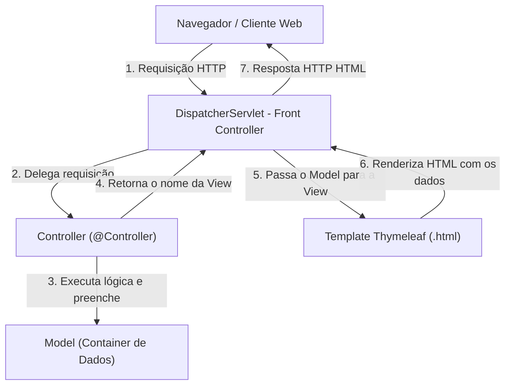

# Capítulo 06: Spring MVC & Thymeleaf

Este resumo cobre a construção de aplicações web server-side utilizando **Spring Boot 4**, a engine de template **Thymeleaf**, binding de formulários HTML, o fluxo interno do **Spring MVC** (`DispatcherServlet`, `Model`, `View`, `Controller`), mapeamento com `@GetMapping` / `@PostMapping`, inclusão de arquivos estáticos (CSS/JS), além do ecossistema completo de validação (**Bean Validation API - Jakarta**, `@InitBinder`, arquivos de mensagens customizadas e **anotações de validação personalizadas**).

---

## 📌 1. Visão Geral do Spring MVC e Thymeleaf

### O que é o Thymeleaf?
O **Thymeleaf** é um motor de templates Java moderno para aplicações web e standalone. Ele processa páginas HTML no lado do servidor (**server-side rendering**), substituindo expressões especiais (`th:*`) por dados dinâmicos do Spring MVC antes de enviar a resposta ao navegador.

> [!NOTE]
> **Pronúncia**: Pronuncia-se *"tyme-leaf"* (com o **H mudo**).

### Dependência Maven (`pom.xml`)
```xml
<dependency>
    <groupId>org.springframework.boot</groupId>
    <artifactId>spring-boot-starter-thymeleaf</artifactId>
</dependency>
<dependency>
    <groupId>org.springframework.boot</groupId>
    <artifactId>spring-boot-starter-web</artifactId>
</dependency>
```

### Convenção de Diretórios do Spring Boot
* **Templates HTML**: `src/main/resources/templates/`
* **Arquivos Estáticos (CSS, JS, Imagens)**: `src/main/resources/static/` (ex: `/css/demo.css`)

---

## 📌 2. Fluxo Interno do Spring MVC (Behind the Scenes)



---

## 📌 3. Controller Básico, Model e Arquivos Estáticos

### Exemplo de Controller (`DemoController.java`)

```java
package com.luv2code.springboot.thymeleafdemo.controller;

import org.springframework.stereotype.Controller;
import org.springframework.ui.Model;
import org.springframework.web.bind.annotation.GetMapping;

@Controller
public class DemoController {

    @GetMapping("/hello")
    public String sayHello(Model theModel) {
        theModel.addAttribute("theDate", java.time.LocalDateTime.now());
        return "helloworld"; // Aponta para src/main/resources/templates/helloworld.html
    }
}
```

### Template HTML com Thymeleaf e CSS (`helloworld.html`)

```html
<!DOCTYPE HTML>
<html xmlns:th="http://www.thymeleaf.org">
<head>
    <title>Thymeleaf Demo</title>
    <!-- Vincula arquivo CSS localizado em src/main/resources/static/css/demo.css -->
    <link rel="stylesheet" th:href="@{/css/demo.css}" />
</head>
<body>
    <p th:text="'Time on the server is ' + ${theDate}" class="funny">Data e Hora</p>
</body>
</html>
```

---

## 📌 4. Mapeamento de Requisições e Extração de Parâmetros

### `GET` vs `POST`

| Característica | HTTP `GET` (`@GetMapping`) | HTTP `POST` (`@PostMapping`) |
| :--- | :--- | :--- |
| **Envio de Dados** | Anexados na URL como *query string* (`?name=John`). | Enviados de forma oculta no **corpo** (*body*) da requisição. |
| **Segurança/Bookmark**| Podem ser marcados nos favoritos da URL; visíveis nos logs. | Não podem ser favoritados com parâmetros; ideal para formulários/dados sensíveis. |
| **Limite de Tamanho**| Restrito pelo tamanho máximo da URL (~2048 chars). | Sem restrições de tamanho (suporta upload de arquivos binários). |

### Formas de Capturar Parâmetros de Formulário

```java
@Controller
public class HelloWorldController {

    @GetMapping("/showForm")
    public String showForm() {
        return "helloworld-form";
    }

    // Abordagem 1: Usando @RequestParam (Recomendado e Simplificado)
    @PostMapping("/processFormVersionThree")
    public String processFormVersionThree(
            @RequestParam("studentName") String theName,
            Model theModel) {

        String result = "Hey My Friend from v3, " + theName.toUpperCase();
        theModel.addAttribute("message", result);
        return "helloworld";
    }
}
```

---

## 📌 5. Data Binding com Objetos (`Form Data Binding`)

Em vez de ler parâmetros individualmente com `@RequestParam`, o Spring MVC permite vincular formulários HTML inteiros diretamente a um objeto Java (**POJO**).

### A Entidade/Bean (`Student.java`)
```java
package com.luv2code.springboot.thymeleafdemo.model;

import java.util.List;

public class Student {
    private String firstName;
    private String lastName;
    private String country;
    private String favoriteLanguage;
    private List<String> favoriteSystems;

    public Student() {}

    // Getters e Setters obrigatórios
    public String getFirstName() { return firstName; }
    public void setFirstName(String firstName) { this.firstName = firstName; }

    public String getLastName() { return lastName; }
    public void setLastName(String lastName) { this.lastName = lastName; }

    public String getCountry() { return country; }
    public void setCountry(String country) { this.country = country; }

    public String getFavoriteLanguage() { return favoriteLanguage; }
    public void setFavoriteLanguage(String favoriteLanguage) { this.favoriteLanguage = favoriteLanguage; }

    public List<String> getFavoriteSystems() { return favoriteSystems; }
    public void setFavoriteSystems(List<String> favoriteSystems) { this.favoriteSystems = favoriteSystems; }
}
```

### O Controller (`StudentController.java`)
Carrega dados dinâmicos das propriedades (`@Value`) e expõe o formulário.

```java
package com.luv2code.springboot.thymeleafdemo.controller;

import com.luv2code.springboot.thymeleafdemo.model.Student;
import org.springframework.beans.factory.annotation.Value;
import org.springframework.stereotype.Controller;
import org.springframework.ui.Model;
import org.springframework.web.bind.annotation.*;

import java.util.List;

@Controller
public class StudentController {

    @Value("${countries}")
    private List<String> countries;

    @Value("${languages}")
    private List<String> languages;

    @Value("${systems}")
    private List<String> systems;

    @GetMapping("/showStudentForm")
    public String showForm(Model theModel) {
        theModel.addAttribute("student", new Student());
        theModel.addAttribute("countries", countries);
        theModel.addAttribute("languages", languages);
        theModel.addAttribute("systems", systems);
        return "student-form";
    }

    @PostMapping("/processStudentForm")
    public String processForm(@ModelAttribute("student") Student theStudent) {
        return "student-confirmation";
    }
}
```

### O Formulário HTML (`student-form.html`)
Usa `th:object="${student}"` e a sintaxe de seleção `*{nomeDoCampo}`:

```html
<form th:action="@{/processStudentForm}" th:object="${student}" method="POST">
    
    <!-- Campo de Texto -->
    First Name: <input type="text" th:field="*{firstName}" /><br/><br/>
    Last Name: <input type="text" th:field="*{lastName}" /><br/><br/>

    <!-- Drop-down List (Select) iterando dinamicamente -->
    Country:
    <select th:field="*{country}">
        <option th:each="tempCountry : ${countries}" 
                th:value="${tempCountry}" 
                th:text="${tempCountry}"></option>
    </select><br/><br/>

    <!-- Radio Buttons -->
    Favorite Programming Language:
    <input type="radio" th:field="*{favoriteLanguage}" 
           th:each="tempLang : ${languages}"
           th:value="${tempLang}" 
           th:text="${tempLang}" /><br/><br/>

    <!-- Checkboxes (Múltipla Seleção vinculada a List<String>) -->
    Favorite Operating Systems:
    <input type="checkbox" th:field="*{favoriteSystems}" 
           th:each="tempSys : ${systems}"
           th:value="${tempSys}" 
           th:text="${tempSys}" /><br/><br/>

    <input type="submit" value="Submit" />
</form>
```

---

## 📌 6. Validação de Formulario (Jakarta Bean Validation)

O Spring Boot utiliza a API **Jakarta Bean Validation** para validar entradas de formulário antes do processamento.

### Dependência Maven para Validação
```xml
<dependency>
    <groupId>org.springframework.boot</groupId>
    <artifactId>spring-boot-starter-validation</artifactId>
</dependency>
```

### Principais Anotações de Validação (`jakarta.validation.constraints.*`)
* **`@NotNull`**: Garante que o campo não seja nulo.
* **`@Size(min=X, max=Y)`**: Define tamanho mínimo e máximo para Strings ou coleções.
* **`@Min(value)` / `@Max(value)`**: Define valores numéricos mínimos e máximos.
* **`@Pattern(regexp="...")`**: Aplica validação baseada em Expressões Regulares (Regex).

---

## 📌 7. Trimming de Strings com `@InitBinder`

Espaços em branco acidentais podem burlar validações de obrigatoriedade. O `@InitBinder` atua como um pré-processador que intercepta todas as requisições enviadas ao controller para limpar os dados.

```java
@Controller
public class CustomerController {

    // Pré-processa todas as Strings das requisições para remover espaços em branco nas extremidades
    // Se a String contiver apenas espaços, converte para null.
    @InitBinder
    public void initBinder(WebDataBinder dataBinder) {
        StringTrimmerEditor stringTrimmerEditor = new StringTrimmerEditor(true);
        dataBinder.registerCustomEditor(String.class, stringTrimmerEditor);
    }
}
```

---

## 📌 8. Tratamento de Erros e Mensagens Personalizadas (`messages.properties`)

Quando ocorrem erros de conversão de tipos (ex: digitar texto num campo numérico `Integer`), o Spring gera mensagens padronizadas extensas. Podemos customizá-las criando o arquivo `src/main/resources/messages.properties`:

```properties
# Estrutura do Erro: tipoDeErro.nomeDoAtributoNoModel.nomeDoCampo
typeMismatch.customer.freePasses=Invalid number. Please enter a digit between 0 and 10.
```

---

## 📌 9. Criando Regras de Validação Personalizadas (Custom Annotations)

Para cenários onde as validações padrão não atendem a regra de negócio (ex: o código do curso deve obrigatoriamente iniciar com o prefixo `"LUV"`), podemos criar uma **anotação Java personalizada**.

### Passo 1: Criar a Anotação (`@CourseCode`)

```java
package com.luv2code.springboot.mvc.validation;

import jakarta.validation.Constraint;
import jakarta.validation.Payload;

import java.lang.annotation.*;

@Constraint(validatedBy = CourseCodeConstraintValidator.class)
@Target({ ElementType.METHOD, ElementType.FIELD })
@Retention(RetentionPolicy.RUNTIME)
public @interface CourseCode {

    // Define o valor padrão do prefixo
    public String value() default "LUV";

    // Define a mensagem de erro padrão
    public String message() default "must start with LUV";

    // Boilerplate obrigatório do Jakarta Validation
    public Class<?>[] groups() default {};
    public Class<? extends Payload>[] payload() default {};
}
```

### Passo 2: Criar a Classe de Validação (`CourseCodeConstraintValidator.java`)

```java
package com.luv2code.springboot.mvc.validation;

import jakarta.validation.ConstraintValidator;
import jakarta.validation.ConstraintValidatorContext;

public class CourseCodeConstraintValidator implements ConstraintValidator<CourseCode, String> {

    private String coursePrefix;

    @Override
    public void initialize(CourseCode theCourseCode) {
        coursePrefix = theCourseCode.value(); // Captura o valor configurado na anotação
    }

    @Override
    public boolean isValid(String theCode, ConstraintValidatorContext theConstraintValidatorContext) {
        // Validação de segurança contra null
        if (theCode == null) {
            return true; 
        }

        // Executa a verificação da regra de negócio
        return theCode.startsWith(coursePrefix);
    }
}
```

### Passo 3: Aplicar no Modelo (`Customer.java`)

```java
public class Customer {

    @NotNull(message="is required")
    @Size(min=1, message="is required")
    private String lastName;

    @NotNull(message="is required")
    @Min(value=0, message="must be greater than or equal to zero")
    @Max(value=10, message="must be less than or equal to 10")
    private Integer freePasses; // Utiliza Integer (wrapper) em vez de int primitivo

    @Pattern(regexp="^[a-zA-Z0-9]{5}$", message="only 5 chars/digits")
    private String postalCode;

    // Utiliza nossa anotação customizada!
    @CourseCode(value="LUV", message="must start with LUV")
    private String courseCode;

    // Getters e Setters...
}
```

### Passo 4: Tratar a Validação no Controller

```java
@PostMapping("/processForm")
public String processForm(
        @Valid @ModelAttribute("customer") Customer theCustomer,
        BindingResult theBindingResult) {

    // O BindingResult DEVE vir IMEDIATAMENTE após o objeto validado (@Valid)
    if (theBindingResult.hasErrors()) {
        return "customer-form"; // Retorna para o formulário em caso de falha
    } else {
        return "customer-confirmation"; // Sucesso!
    }
}
```

---

## 📋 Tabela Resumo das Anotações e Sintaxes do Capítulo 06

| Anotação / Sintaxe | Contexto / Pacote | Propósito / Descrição |
| :--- | :--- | :--- |
| **`@Controller`** | `org.springframework.stereotype` | Indica que a classe é um Controller MVC que retorna Views HTML. |
| **`@ModelAttribute`** | `org.springframework.web.bind.annotation` | Vincula o objeto do Model recebido no payload do formulário. |
| **`@RequestParam`** | `org.springframework.web.bind.annotation` | Captura parâmetros individuais enviados na requisição HTTP. |
| **`@InitBinder`** | `org.springframework.web.bind.annotation` | Registra pré-processadores de requisição (ex: trimming de Strings). |
| **`th:text="${...}"`** | Thymeleaf HTML | Renderiza o texto extraído do atributo do Model no elemento HTML. |
| **`th:object="${...}"`**| Thymeleaf HTML | Define o objeto base para binding de formulário no elemento `<form>`. |
| **`th:field="*{...}"`** | Thymeleaf HTML | Vincula um campo do formulário à propriedade do objeto (`*{field}`). |
| **`th:each="item : ${list}"`**| Thymeleaf HTML | Executa um loop de repetição sobre uma coleção. |
| **`th:if="${...}"`** | Thymeleaf HTML | Renderização condicional de um nó/tag HTML. |
| **`@Valid`** | `jakarta.validation` | Dispara o processo de validação das restrições do objeto enviado. |
| **`BindingResult`** | `org.springframework.validation` | Mantém os resultados e erros detectados na verificação do `@Valid`. |
