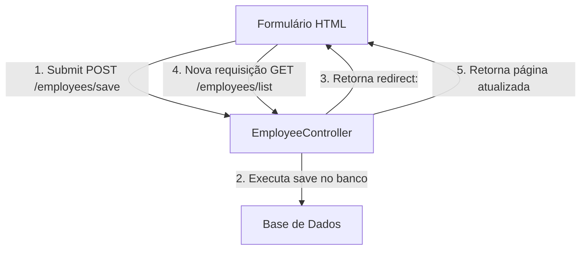

# Capítulo 07: Spring MVC CRUD

Este resumo abrange o desenvolvimento de uma aplicação web completa de CRUD (**Create, Read, Update, Delete**) utilizando **Spring Boot 4**, **Spring MVC**, **Thymeleaf**, **Spring Data JPA** e estilização responsiva com **Bootstrap 5**. Também descreve o padrão arquitetural **Post/Redirect/Get (PRG)** e ordenação customizada de dados no repositório.

---

## 📌 1. Visão Geral da Arquitetura do Sistema CRUD

A aplicação segue a arquitetura de camadas completa em Java/Spring:

```text
[Navegador / HTML Client]
          │
          ▼
┌───────────────────────────────────────────────────────────┐
│ Spring MVC Controller (@Controller)                       │
│  └─ Gerencia requisições web, Model e Views Thymeleaf     │
└───────────────────────────────────────────────────────────┘
          │
          ▼
┌───────────────────────────────────────────────────────────┐
│ Camada de Serviço (@Service)                              │
│  └─ Regras de negócio e controle transacional             │
└───────────────────────────────────────────────────────────┘
          │
          ▼
┌───────────────────────────────────────────────────────────┐
│ Spring Data JPA Repository (JpaRepository)                │
│  └─ Abstração de persistência/acesso ao banco             │
└───────────────────────────────────────────────────────────┘
          │
          ▼
┌───────────────────────────────────────────────────────────┐
│ Banco de Dados (MySQL)                                    │
└───────────────────────────────────────────────────────────┘
```

---

## 📌 2. Configuração Básica e redirecionamento de Raiz (`index.html`)

Para evitar telas de Erro 404 quando o usuário acessa a raiz `http://localhost:8080/`, cria-se um arquivo `index.html` estático em `src/main/resources/static/` que redireciona automaticamente para o endpoint `/employees/list`.

### `src/main/resources/static/index.html`
```html
<!DOCTYPE html>
<html>
<head>
    <!-- Redireciona imediatamente (0 segundos) para /employees/list -->
    <meta http-equiv="refresh" content="0; url=employees/list" />
</head>
<body>
</body>
</html>
```

---

## 📌 3. Leitura e Ordenação de Dados (Read)

No controller, recuperamos os dados através do serviço e adicionamos à instância do `Model`.

### 3.1 Ordenação Automática via Spring Data JPA (`EmployeeRepository.java`)
O Spring Data JPA permite criar consultas ordenadas baseando-se apenas na convenção de nome do método:

```java
package com.luv2code.springboot.thymeleafdemo.dao;

import com.luv2code.springboot.thymeleafdemo.entity.Employee;
import org.springframework.data.jpa.repository.JpaRepository;
import java.util.List;

public interface EmployeeRepository extends JpaRepository<Employee, Integer> {

    // O Spring Data JPA traduz automaticamente para:
    // "SELECT e FROM Employee e ORDER BY e.lastName ASC"
    List<Employee> findAllByOrderByLastNameAsc();
}
```

---

### 3.2 O Controller (`EmployeeController.java`)

```java
package com.luv2code.springboot.thymeleafdemo.controller;

import com.luv2code.springboot.thymeleafdemo.entity.Employee;
import com.luv2code.springboot.thymeleafdemo.service.EmployeeService;
import org.springframework.beans.factory.annotation.Autowired;
import org.springframework.stereotype.Controller;
import org.springframework.ui.Model;
import org.springframework.web.bind.annotation.*;

import java.util.List;

@Controller
@RequestMapping("/employees")
public class EmployeeController {

    private final EmployeeService employeeService;

    @Autowired
    public EmployeeController(EmployeeService theEmployeeService) {
        employeeService = theEmployeeService;
    }

    @GetMapping("/list")
    public String listEmployees(Model theModel) {
        // Busca os funcionários ordenados
        List<Employee> theEmployees = employeeService.findAll();
        
        // Adiciona a lista ao Spring Model
        theModel.addAttribute("employees", theEmployees);
        
        return "employees/list-employees"; // Template HTML
    }
}
```

---

### 3.3 A View Thymeleaf com Bootstrap 5 (`list-employees.html`)

```html
<!DOCTYPE HTML>
<html xmlns:th="http://www.thymeleaf.org">
<head>
    <title>Employee Directory</title>
    <meta charset="utf-8">
    <meta name="viewport" content="width=device-width, initial-scale=1">

    <!-- Bootstrap CSS CDN -->
    <link href="https://cdn.jsdelivr.net/npm/bootstrap@5.3.0/dist/css/bootstrap.min.css" rel="stylesheet">
</head>
<body>

<div class="container mt-4">
    <h3>Employee Directory</h3>
    <hr>

    <!-- Botão de Adicionar Novo Funcionário -->
    <a th:href="@{/employees/showFormForAdd}" class="btn btn-primary btn-sm mb-3">
        Add Employee
    </a>

    <!-- Tabela estilizada com Bootstrap -->
    <table class="table table-bordered table-striped">
        <thead class="table-dark">
            <tr>
                <th>First Name</th>
                <th>Last Name</th>
                <th>Email</th>
                <th>Action</th>
            </tr>
        </thead>
        <tbody>
            <tr th:each="tempEmployee : ${employees}">
                <td th:text="${tempEmployee.firstName}"></td>
                <td th:text="${tempEmployee.lastName}"></td>
                <td th:text="${tempEmployee.email}"></td>
                <td>
                    <!-- Link de Atualização com ID dinâmico -->
                    <a th:href="@{/employees/showFormForUpdate(employeeId=${tempEmployee.id})}"
                       class="btn btn-info btn-sm">
                        Update
                    </a>

                    <!-- Link de Exclusão com confirmação JS -->
                    <a th:href="@{/employees/delete(employeeId=${tempEmployee.id})}"
                       class="btn btn-danger btn-sm"
                       onclick="if (!(confirm('Are you sure you want to delete this employee?'))) return false;">
                        Delete
                    </a>
                </td>
            </tr>
        </tbody>
    </table>
</div>

</body>
</html>
```

---

## 📌 4. Adição de Novos Registros (Create) & O Padrão PRG

### O Padrão Post / Redirect / Get (PRG)
Para evitar o envio duplicado de formulários quando o usuário clica em "Atualizar/Reload" no navegador, a requisição `POST` de salvar não retorna um template HTML diretamente. Em vez disso, ela retorna um comando de redirecionamento HTTP 302 (`redirect:/employees/list`), fazendo com que o navegador dispare uma nova requisição `GET`.



### 4.1 Métodos do Controller para Adição

```java
@GetMapping("/showFormForAdd")
public String showFormForAdd(Model theModel) {
    // Cria objeto em branco para vinculação dos campos
    Employee theEmployee = new Employee();
    theModel.addAttribute("employee", theEmployee);
    
    return "employees/employee-form";
}

@PostMapping("/save")
public String saveEmployee(@ModelAttribute("employee") Employee theEmployee) {
    // Salva o funcionário no banco de dados
    employeeService.save(theEmployee);
    
    // Uso do padrão PRG para evitar ressubmissão de dados
    return "redirect:/employees/list";
}
```

---

## 📌 5. Atualização de Registros (Update)

O processo de atualização reutiliza a mesma página HTML do formulário de adição (`employee-form.html`).

### Como o Spring Data JPA diferencia `INSERT` de `UPDATE`?
* Se o objeto `Employee` possui **`id == 0`** ou **`id == null`**, o repositório executa um `INSERT` (`entityManager.persist()`).
* Se o objeto `Employee` possui um **`id` válido** que já existe no banco, o repositório executa um `UPDATE` (`entityManager.merge()`).

### 5.1 O Campo Oculto no Formulário (`hidden field`)
Para manter a referência do `id` do funcionário que está sendo alterado durante a submissão do formulário, utiliza-se um campo do tipo `hidden`:

```html
<input type="hidden" th:field="*{id}" />
```

### 5.2 Formulário HTML Unificado (`employee-form.html`)

```html
<!DOCTYPE HTML>
<html xmlns:th="http://www.thymeleaf.org">
<head>
    <title>Save Employee</title>
    <meta charset="utf-8">
    <meta name="viewport" content="width=device-width, initial-scale=1">
    <link href="https://cdn.jsdelivr.net/npm/bootstrap@5.3.0/dist/css/bootstrap.min.css" rel="stylesheet">
</head>
<body>

<div class="container mt-4">
    <h3>Employee Directory</h3>
    <hr>

    <p class="h4 mb-4">Save Employee</p>

    <form th:action="@{/employees/save}" th:object="${employee}" method="POST">

        <!-- Campo Oculto obrigatório para manter o ID e permitir UPDATE -->
        <input type="hidden" th:field="*{id}" />

        <input type="text" th:field="*{firstName}"
               class="form-control mb-4 col-4" placeholder="First name" />

        <input type="text" th:field="*{lastName}"
               class="form-control mb-4 col-4" placeholder="Last name" />

        <input type="text" th:field="*{email}"
               class="form-control mb-4 col-4" placeholder="Email" />

        <button type="submit" class="btn btn-info col-2">Save</button>
    </form>

    <hr>
    <a th:href="@{/employees/list}">Back to Employees List</a>
</div>

</body>
</html>
```

### 5.3 Método do Controller para Edição (`EmployeeController.java`)

```java
@GetMapping("/showFormForUpdate")
public String showFormForUpdate(@RequestParam("employeeId") int theId, Model theModel) {
    // Busca o funcionário pelo ID
    Employee theEmployee = employeeService.findById(theId);
    
    // Preenche o Model com os dados existentes para pré-popular o formulário
    theModel.addAttribute("employee", theEmployee);
    
    return "employees/employee-form";
}
```

---

## 📌 6. Exclusão de Registros (Delete)

Para realizar a exclusão de um registro, o ID do funcionário é passado via parâmetro de URL (`@RequestParam`).

### 6.1 Método do Controller para Remoção

```java
@GetMapping("/delete")
public String delete(@RequestParam("employeeId") int theId) {
    // Remove o funcionário pelo ID
    employeeService.deleteById(theId);
    
    // Redireciona para a lista atualizada
    return "redirect:/employees/list";
}
```

---

## 📋 Tabela Resumo das Rotas e Métodos CRUD do Capítulo 07

| Método HTTP | Endpoint / URL | Método no Controller | Ação Realizada |
| :--- | :--- | :--- | :--- |
| **`GET`** | `/employees/list` | `listEmployees()` | Busca todos os funcionários (ordenados por sobrenome) e exibe a tabela. |
| **`GET`** | `/employees/showFormForAdd` | `showFormForAdd()` | Instancia um novo `Employee` vazio e exibe o formulário de cadastro. |
| **`GET`** | `/employees/showFormForUpdate` | `showFormForUpdate()` | Busca o `Employee` por ID e exibe o formulário pré-populado com os dados. |
| **`POST`**| `/employees/save` | `saveEmployee()` | Salva (`insert`/`update`) a entidade e redireciona via padrão PRG. |
| **`GET`** | `/employees/delete` | `delete()` | Remove o registro pelo ID informado na URL e redireciona para a lista. |
